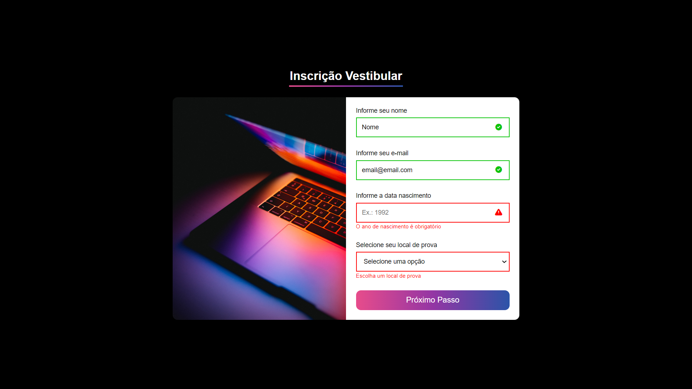

## 📌 Criação de Formulário com Validações

Exercício de validação de formulário da <a target="_blank" href="https://cubos.academy/">**Cubos Academy**</a>. O conteúdo não foi modificado, mas a estilização e as funcionalidades são autorais. Nesse projeto, a manipulação da DOM foi muito trabalhada.

| O que foi acrescentado: | 
| ------ |
| ✅ Responsividade com o uso do media query   |
| ✅ Campos de digitação interativos |

#### 👉🏼 <a target="_blank" href="https://form-exercise-bymisantana.netlify.app/">**VISUALIZE O PROJETO**</a>

## 🛠 Ferramentas

## ✒️ Visual

Feito com 💜 por <a target="_blank" href="https://www.linkedin.com/in/mi-santana/">Milena Santana</a> 😊

