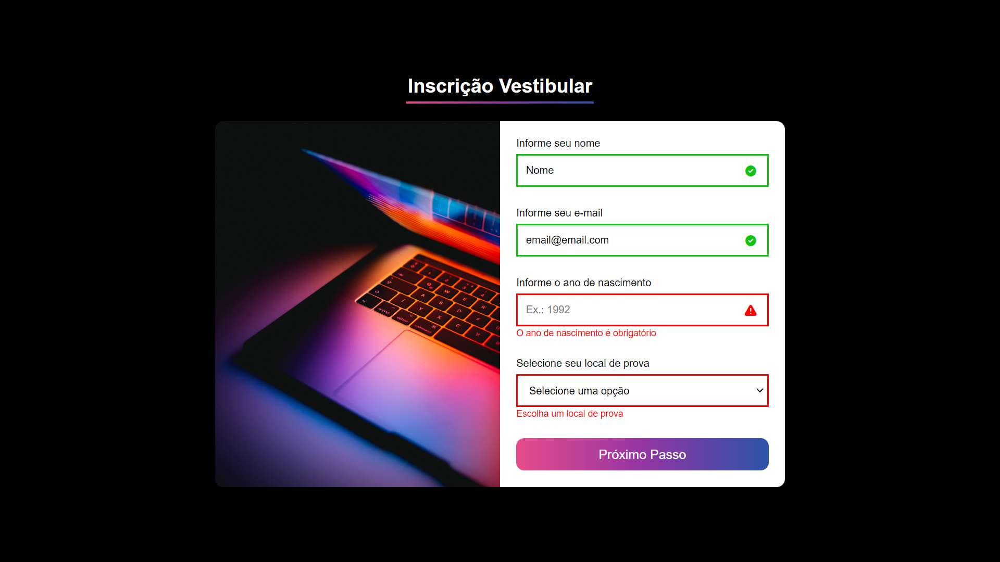

## Form Exercise 💻

Exercício de validação de formulário da <a target="_blank" href="https://cubos.academy/">**Cubos Academy**</a>. O conteúdo não foi modificado, mas a estilização e as funcionalidades são autorais. Nesse projeto, a manipulação da DOM foi muito trabalhada.

### O que foi acrescentado:

- [x] Responsividade com o uso do media query
- [x] Campos de digitação interativos

### Ferramentas utilizadas:

### 👉🏼 <a target="_blank" href="https://form-exercise-bymisantana.netlify.app/">**Visualize o projeto**</a>

## Visual

